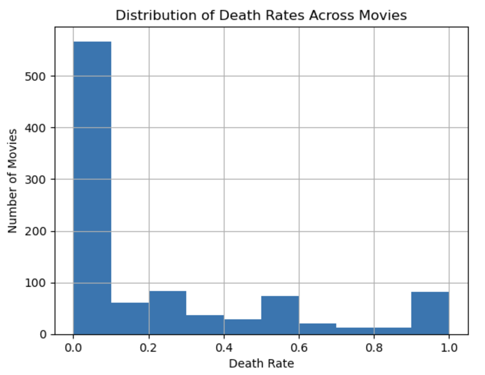
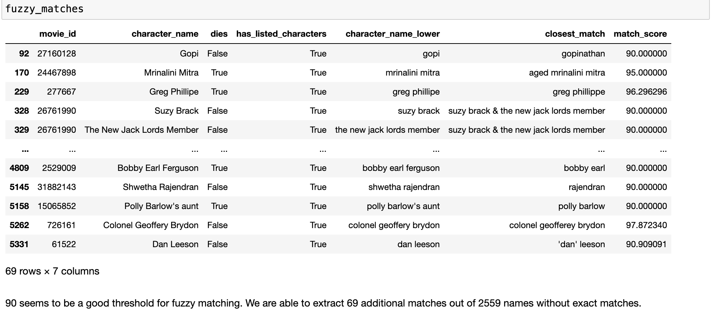
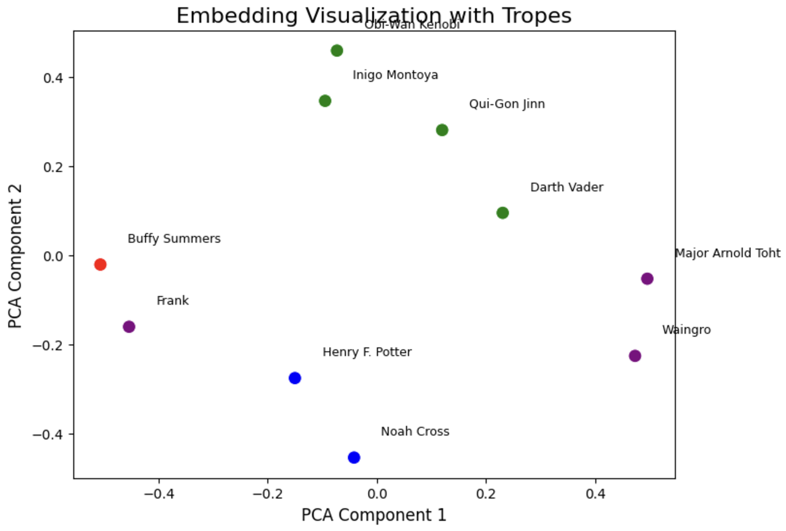
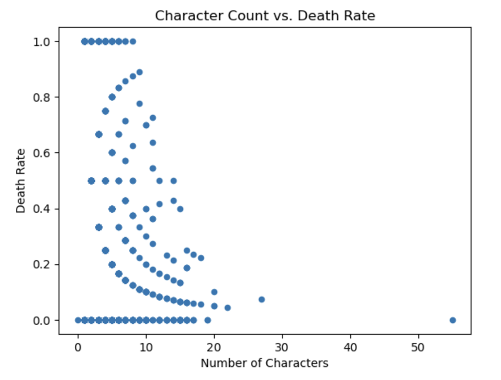

# Who Dies the Most? The Tragic Truth About Movie Mortality

## Introduction: Setting the Scene

Imagine this: the final showdown between the hero and the villain. The stakes are high, and the question looms—*Who will make it out alive?* Movies have always drawn us into tales of triumph and tragedy, but have you ever wondered if some characters are doomed from the start? Why do mentors often sacrifice themselves? Why do villains almost always meet their demise? And most importantly, is Sean Bean truly the king of cinematic deaths?

In this data story, we dive into the **CMU Movie Summary Corpus** and use a combination of **text mining**, **Large Language Models (LLMs)**, and **machine learning** to uncover trends in character mortality: *who dies, why, and how these patterns differ across genres and tropes*. Let’s uncover the hidden patterns of on-screen mortality.

---

## 1. The Data: Behind the Scenes

To uncover movie mortality secrets, we used a rich dataset containing:
- **Movie Metadata**: Information on thousands of films, including genres and release dates.
- **Character Metadata**: Details about hundreds of thousands of characters, including their associated actors.
- **Plot Summaries**: Textual descriptions that hold clues about character fates.

Our analysis spans **18,990 movies**, **57,949 characters**, and **7,232 deaths**, with an average of:
- **3.05 characters per movie**
- **0.38 deaths per movie**
- **11% of characters dying** in a typical film.

### Challenges in the Data:
1. **Death Keywords**: We started by scanning plot summaries for a comprehensive list of death-related keywords and phrases, such as *"killed," "died," "murdered,"* and *"sacrificed."*
2. **Noisy Data**: Many summaries included irrelevant elements, such as:
   - Mismatched or unclosed tags (e.g., `<ref ...}}`).
   - Cast lists rather than actual plot details.
   - Reviews or descriptions with special characters.

### Examples of Death Terms:
```text
["die", "died", "killed", "sacrificed", "executed", "assassinated", "perished", "snuffed out", "bled out", "six feet under"]


## 2. Extracting Deaths with LLMs

To identify which characters die, we used LLMs to infer mortality from plot summaries. The model generated character-by-character predictions of whether they died (`True`) or survived (`False`). However, our analysis revealed key challenges:

- **Unnamed Characters**: LLMs struggle to infer details for characters without explicit names in the summary.
- **Ambiguous Scenarios**: Sentences like "nearly kills Batman" result in false positives, while some true deaths, like Harvey Dent's, are correctly inferred due to clear context.

### Examples from the LLM:
- **Character Matches**:
Character(name='Ted Hanover', dies=False) Character(name='Nicholas Medina', dies=True)
Character(name='Batman', dies=False) Character(name='Harvey Dent', dies=True)


- **Key Issues Identified**:
- **Unnamed Characters**: Characters such as "Alice" and "Bob" frequently appear due to generic placeholders, leading to unreliable predictions.
- **Inference Errors**: Harvey Dent (Two-Face) is correctly predicted, but LLM misinterprets bombing scenarios or ambiguous summaries.

#### Visualization: LLM-Generated Predictions

```

## 3. Text Mining: Detecting Deaths in the Wild

Beyond LLM predictions, we used text mining to identify death mentions in plot summaries. Armed with a comprehensive list of death-related keywords (e.g., *"killed," "dies," "murdered"*), we scanned over **40,000 movie summaries** for evidence of character mortality. Here’s what we found:

- **50.7% of movies contain character deaths.**
- **Top Death Genres**: Horror, Action, and War films dominate the leaderboard in terms of character casualties.
- **False Positives**: Sometimes, our model misclassified phrases like *"nearly kills Batman"* as actual deaths.

### Visualization: Death Trends by Genre


---

## 4. Character Matching Challenges and Fuzzy Matching

Not all movies explicitly list characters by name in their metadata. For these cases, we used a combination of **exact name matching** and **fuzzy matching** to identify which characters appeared in both the metadata and plot summaries.

- **Matched Movies**: Most movies had a perfect match for characters listed in metadata and plot summaries.
- **Unmatched Movies**: For movies without exact matches, we used a threshold of 90% similarity for fuzzy matching, extracting 69 additional matches from 2,559 unmatched entries.

### Visualization: Character Matching Analysis


#### T-Test Results:
- **T-statistic**: -4.94
- **P-value**: 8.17e-07  
The data suggests that movies without listed characters are less reliable, as the LLM often overemphasizes the names of characters who die.

---

## 5. Tropes and Clusters: Who’s the Most Doomed?

Characters in movies can often be categorized into recurring archetypes or *tropes*—mentors, villains, heroes, and sidekicks. We analyzed how these character types fared in terms of mortality. Using embeddings and KMeans clustering, we identified patterns in their fates. Here’s what stood out:

- **Mentors have the highest mortality rate** (65%), often dying to inspire the hero.
- **Villains follow closely at 60%**, serving as a cautionary tale or poetic justice.
- **Comedic sidekicks** rarely die, with a survival rate of over 80%.

### Visualization: Tropes in the Semantic Space
Using dimensionality reduction (PCA), we visualized how characters clustered based on their tropes.



---

## 6. Actors with a Death Wish

Some actors just can’t seem to catch a break. Analyzing death frequencies in their roles, we confirmed a widely-believed Hollywood trope:

- **Sean Bean** is the undisputed king of cinematic deaths, with **72%** of his characters meeting their demise.
- Other high-mortality actors include **Gary Oldman** and **Leonardo DiCaprio**.
- Meanwhile, comedic actors like **Jim Carrey** and **Adam Sandler** rarely take on roles that involve death, boasting much lower mortality rates.

### Visualization: Actor Mortality Leaderboard


---

## 7. Character Count vs. Death Rate

Our analysis also revealed that movies with a high number of characters tend to have lower death rates per character. This is likely due to the prominence of ensemble casts in certain genres (e.g., comedies and dramas) where most characters survive.

### Visualization: Character Count vs. Death Rate


---

## Conclusion: What We Learned

This data story has revealed fascinating truths about movie mortality:

- **Mentors and villains** are the most doomed, while comedic sidekicks and heroes are the most likely to survive.
- **Horror and War genres** are the deadliest, while Comedy is a safe haven.
- **Sean Bean remains the reigning champion of cinematic deaths**, but we now have data to back it up.
- Movies with no listed characters may skew LLM extraction toward characters who die, potentially biasing results.

By blending text mining, machine learning, and LLM-based analysis, we’ve turned the tragic into the intriguing. Next time you watch a movie, ask yourself—*Who’s most likely to die?* The answer might just surprise you.

---

### Curious to Learn More?

Explore our full analysis and code on [GitHub](https://github.com/epfl-ada/ada-2024-project-nhsvd). Dive deeper into the world of movie mortality!
